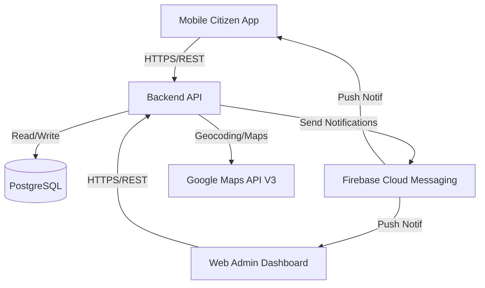

# Public Complaint App (Aplikasi Pengaduan Masyarakat)

This document outlines the technical plan for building a robust public complaint system with citizen-facing status transparency, GPS integration, and automated escalation to government agencies (SKPD).

## System Architecture

The application will consist of three main components:
1. **Mobile Citizen App**: For citizens to report issues with LBS/GPS and track status. (Android Native - Kotlin)
2. **Web Admin Dashboard**: For administrators and SKPD staff to manage and process reports. (React.js + Vite + Vanilla CSS)
3. **Backend API**: The central nervous system handling business logic, notifications, and data storage. (Node.js/Express)

## Features & Implementation Strategy

### 1. Implementasi LBS & GPS
- **Citizen App**: Use `FusedLocationProviderClient` (Google Play Services) in Kotlin to capture latitude and longitude.
- **Accuracy**: Request `PRIORITY_HIGH_ACCURACY` for precise complaint location.
- **Backend**: Store coordinates as a `Geography` type in PostgreSQL (using PostGIS).

### 2. Kirim Pengaduan (Send Complaints)
- **Multi-step Form** (Langkah 1–3, with progress indicator):
    - **Step 1 – Detail Pengaduan (Complaint Details)**: Select complaint category and enter complaint title.
    - **Step 2 – Deskripsi & Bukti (Description & Evidence)**: Provide a detailed description and attach supporting media (photo/video).
    - **Step 3 – Lokasi Pengaduan (Complaint Location)**:
        - Interactive map with **Live GPS** and draggable pin (**Posisikan Pin**) to pinpoint the exact incident location (**Lokasi Kejadian**).
        - **Alamat Detail** (Detailed Address): Auto-filled from the selected coordinates (e.g., street, district, city, postal code).
        - **Tambahan Acuan** (Reference Landmark – Optional): Free-text field for additional location context (e.g., "Di depan Halte Busway Gelora Bung Karno").
        - **Kirim Laporan** (Submit Report) button to finalize and send the complaint.
- **Offline Support**: Allow saving drafts if internet is unstable.

### 3. Citizen Complaint Tracking
- **Priority**: This is the next major milestone after complaint submission and admin status management.
- **Android Detail Screen**: Add a citizen-facing complaint detail view launched from the complaint list.
- **Status Timeline**: Reuse the existing `ComplaintLog` records to render `SUBMITTED` and all later state transitions in chronological order.
- **Complaint Metadata**: Show assigned SKPD, status notes, timestamps, coordinates, and attached photo when available.
- **V1 Scope**: Reuse `GET /api/complaints/:id` for complaint detail instead of promising a new API contract.
- **Phase 2**: Push notifications or an in-app inbox can follow later; they are not blockers for the first version.

### 4. Tracking Status
- **Status Log Timeline**: Automated capture of every state transition in the complaint lifecycle.
- **Progress Visibility**: Clear visual indicators of "Old Status → New Status" with handling notes.
- **Rationale**: This closes the feedback loop for citizens, improves trust/transparency, and leverages backend/admin capabilities that are already implemented.

### 5. Integrasi Google Maps API V3
- **Admin Dashboard**:
    - **Interactive Map**: Display markers for all 'Active' complaints.
    - **Marker Info**: Click marker to see complaint summary and direct link to details.
    - **Route Visualization**: Show distance/route from closest SKPD to the complaint location (optional feature).

### 6. Notifikasi Real-time (FCM)
- **User Flows**:
    - **Citizen**: Receives "Verified", "In Progress", and "Resolved" updates.
    - **SKPD Staff**: Receives "New Assignment" notification.
- **In-App Inbox**: Store notification history for users to read later.

### 7. Manajemen SKPD
- **Automated Routing**: Map categories (Infrastruktur, Kebersihan, Keamanan) to specific SKPD IDs.
- **Workload Balance**: Admin can see how many active reports each SKPD is currently handling.

### 8. Dashboard Admin (Web-based)
- **Status**: Secure Management Suite Implemented.
- **Layout**: Sidebar navigation, Top bar with summary stats (Live data from Backend).
- **Authentication**: Secure Login page with JWT token management and auto-interceptor.
- **Protected Routes**: Navigation strictly enforced for authenticated Admin roles.
- **Map View**: Integrated with dashboard overview (placeholder for Google Maps JS SDK).
- **Complaints Management**: Full table view with status filtering, detail views, and tracking logs.
- **SKPD/Category Management**: Interactive modules to manage government entities and complaint types.
- **API Integration**: Centralized Axios service layer for all backend interactions.

## UI/UX Design Mockups

### Admin Dashboard (Executive Overview)

### Citizen App (LBS & GPS Form)

## API Design (Implemented Endpoints)

### Complaints
| Method | Endpoint | Description |
| :--- | :--- | :--- |
| `POST` | `/api/complaints` | Submit a new complaint with coordinates and photo. |
| `GET` | `/api/complaints` | Fetch all complaints (Filterable by status, skpd_id, category_id). |
| `GET` | `/api/complaints/:id` | Get detailed report with tracking history (logs). |
| `PATCH` | `/api/complaints/:id/status` | Update status (SUBMITTED, VERIFIED, IN_PROGRESS, RESOLVED, CLOSED). |

### Backend Hardening Required for Citizen Tracking
- Protect complaint and admin routes with JWT middleware instead of leaving them publicly callable.
- Restrict complaint detail access so a citizen can only read their own complaints, while admins/SKPD staff retain authorized access.
- If needed later, narrow complaint list responses by authenticated ownership; this is an implementation requirement, not a new product feature.

### Users
| Method | Endpoint | Description |
| :--- | :--- | :--- |
| `POST` | `/api/users/register` | Register a new user (Citizen/Admin/SKPD). |
| `POST` | `/api/users/login` | Secure authentication with email and password. |
| `GET` | `/api/users` | List all registered users (Excludes passwords). |

### Admin & SKPD Management
| Method | Endpoint | Description |
| :--- | :--- | :--- |
| `GET` | `/api/admin/categories` | List all report categories and linked SKPD. |
| `POST` | `/api/admin/categories` | Add new complaint category. |
| `GET` | `/api/admin/skpds` | List all SKPD departments. |
| `POST` | `/api/admin/skpds` | Register new SKPD department. |

## Implemented Database Schema (Relational)

### `users`
- `id`, `name`, `email`, `password` (Hashed), `role` (CITIZEN, ADMIN, SKPD_STAFF), `fcm_token`

### `skpd` (Satuan Kerja Perangkat Daerah)
- `id`, `name`, `description`, `category_id`

### `categories`
- `id`, `name` (e.g., Infrastruktur, Kebersihan)

### `complaints`
- `id`, `citizen_id`, `category_id`, `skpd_id`, `title`, `description`, `photo_url`, `latitude`, `longitude`, `status`, `created_at`

### `complaint_logs`
- `id`, `complaint_id`, `status_from`, `status_to`, `notes`, `created_at`

### Backend API (Node.js/Express)
- **Framework**: Express.js with a modular Controller-Route pattern.
- **ORM**: Sequelize (PostgreSQL) with automatic schema synchronization.
- **Security**: JWT Authentication, Bcrypt hashing, Helmet, CORS integration.
- **Logging**: Morgan ('dev' format) for request monitoring.
- **Seeder**: `seed.js` included for rapid environment setup with mock data (including secure passwords).

### Citizen App (Mobile Native)
- **Status**: Core authentication, session management, and complaint submission implemented.
- **Next Priority**: Citizen complaint detail and tracking timeline.
- **Framework**: Kotlin (Android Native) with ViewBinding.
- **DI Container**: Koin (Koin-Android 3.4.0) for repository and ViewModel injection.
- **Network**: Retrofit 2.9.0 with OkHttp & Logging Interceptor.
- **Session**: Secure SharedPreferences (SessionManager) for JWT persistence.
- **Architecture**: MVVM (Model-View-ViewModel) with Coroutines for async tasks.
- **Branding**: Custom premium theme (Slate & Brand Blue) matching the Admin dashboard.

## Verification Plan

### Automated Tests
- Integration tests for the "Kirim Pengaduan" API flow.
- Integration tests for `GET /api/complaints/:id` authorization and ownership enforcement.
- Mock FCM service to verify notification triggers.
- Unit tests for SKPD assignment logic.

### Manual Verification
- Verify a citizen can open a complaint from the Android list and view complaint details.
- Verify the timeline includes the initial `SUBMITTED` log and all later status transitions in chronological order.
- Verify assigned SKPD, notes, timestamps, coordinates, and attached evidence render correctly when present.
- Verify the Android detail screen handles missing optional values cleanly.
- Verify unauthorized users cannot access other users' complaints after route protection is enabled.
- Test GPS coordinate accuracy on physical mobile devices.
- Verify Google Map markers alignment with captured coordinates in the Admin Dashboard.
