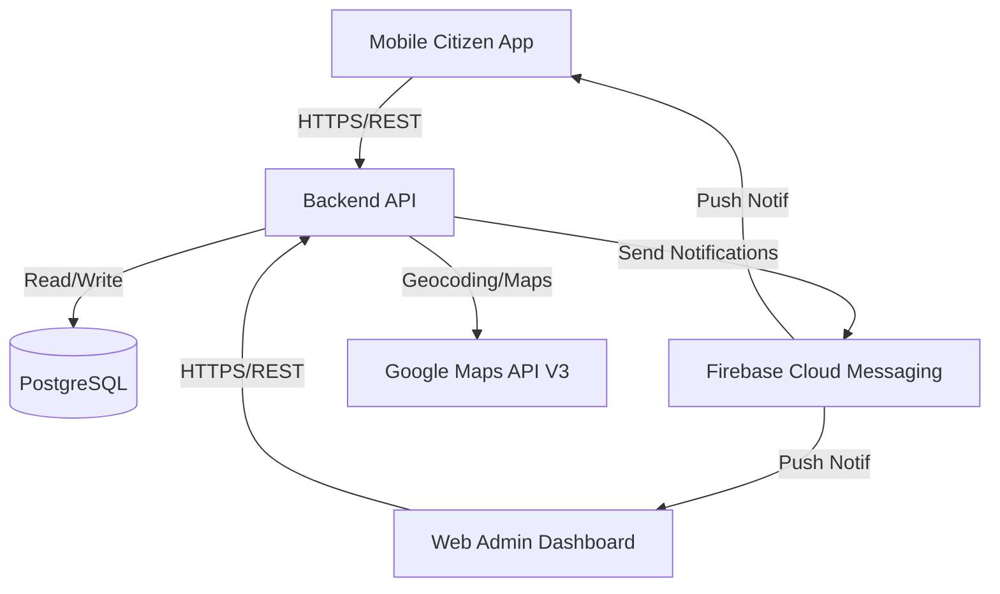
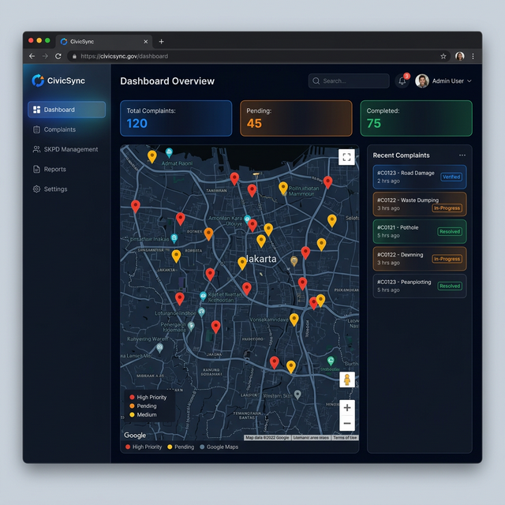
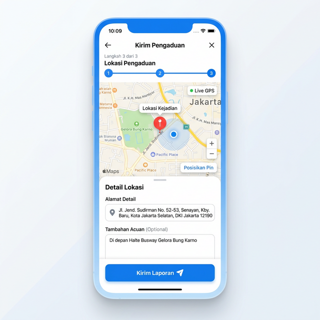

# Public Complaint App (Aplikasi Pengaduan Masyarakat)

This document outlines the technical plan for building a robust public complaint system with real-time tracking, GPS integration, and automated escalation to government agencies (SKPD).

## System Architecture

The application will consist of three main components:
1. **Mobile Citizen App**: For citizens to report issues with LBS/GPS and track status. (Android Native - Kotlin)
2. **Web Admin Dashboard**: For administrators and SKPD staff to manage and process reports. (React.js + Vite + Vanilla CSS)
3. **Backend API**: The central nervous system handling business logic, notifications, and data storage. (Node.js/Express)

## Features & Implementation Strategy

### 1. Implementasi LBS & GPS
- **Citizen App**: Use `FusedLocationProviderClient` (Google Play Services) in Kotlin to capture latitude and longitude.
- **Accuracy**: Request `PRIORITY_HIGH_ACCURACY` for precise complaint location.
- **Backend**: Store coordinates as a `Geography` type in PostgreSQL (using PostGIS).

### 2. Integrasi Google Maps API V3
- **Admin Dashboard**: 
    - **Interactive Map**: Display markers for all 'Active' complaints.
    - **Marker Info**: Click marker to see complaint summary and direct link to details.
    - **Route Visualization**: Show distance/route from closest SKPD to the complaint location (optional feature).

### 3. Kirim Pengaduan (Send Complaints)
- **Multi-step Form**:
    - Step 1: Category & Title.
    - Step 2: Description & Media (Photo/Video).
    - Step 3: Location verification (Automated GPS + Manual adjust).
- **Offline Support**: Allow saving drafts if internet is unstable.

### 4. Notifikasi Real-time (FCM)
- **User Flows**:
    - **Citizen**: Receives "Verified", "In Progress", and "Resolved" updates.
    - **SKPD Staff**: Receives "New Assignment" notification.
- **In-App Inbox**: Store notification history for users to read later.

### 5. Manajemen SKPD
- **Automated Routing**: Map categories (Infrastruktur, Kebersihan, Keamanan) to specific SKPD IDs.
- **Workload Balance**: Admin can see how many active reports each SKPD is currently handling.

### 6. Dashboard Admin (Web-based)
- **Status**: Core layout and data fetching implemented.
- **Layout**: Sidebar navigation, Top bar with summary stats (Live data from Backend).
- **Map View**: Integrated with dashboard overview (placeholder for Google Maps JS SDK).
- **Complaints Management**: Full table view with status filtering implemented.
- **API Integration**: Axios services created for all complaint and admin actions.

### 7. Tracking Status
- **Progress Bar**: Visual indicator of the complaint status.
- **Comments/Feedback**: Citizen can reply to SKPD updates for clarifications.

## UI/UX Design Mockups

### Admin Dashboard (Google Maps Integration)

### Citizen App (LBS & GPS Form)

## API Design (Implemented Endpoints)

### Complaints
| Method | Endpoint | Description |
| :--- | :--- | :--- |
| `POST` | `/api/complaints` | Submit a new complaint with coordinates and photo. |
| `GET` | `/api/complaints` | Fetch all complaints (Filterable by status, skpd_id, category_id). |
| `GET` | `/api/complaints/:id` | Get detailed report with tracking history (logs). |
| `PATCH` | `/api/complaints/:id/status` | Update status (SUBMITTED, VERIFIED, IN_PROGRESS, RESOLVED, CLOSED). |

### Users
| Method | Endpoint | Description |
| :--- | :--- | :--- |
| `POST` | `/api/users/register` | Register a new user (Citizen/Admin/SKPD). |
| `GET` | `/api/users` | List all registered users. |

### Admin & SKPD Management
| Method | Endpoint | Description |
| :--- | :--- | :--- |
| `GET` | `/api/admin/categories` | List all report categories and linked SKPD. |
| `POST` | `/api/admin/categories` | Add new complaint category. |
| `GET` | `/api/admin/skpds` | List all SKPD departments. |
| `POST` | `/api/admin/skpds` | Register new SKPD department. |

## Implemented Database Schema (Relational)

### `users`
- `id`, `name`, `email`, `role` (CITIZEN, ADMIN, SKPD_STAFF), `fcm_token`

### `skpd` (Satuan Kerja Perangkat Daerah)
- `id`, `name`, `description`, `category_id`

### `categories`
- `id`, `name` (e.g., Infrastruktur, Kebersihan)

### `complaints`
- `id`, `citizen_id`, `category_id`, `skpd_id`, `title`, `description`, `photo_url`, `latitude`, `longitude`, `status`, `created_at`

### `complaint_logs`
- `id`, `complaint_id`, `status_from`, `status_to`, `notes`, `created_at`

### Backend API (Node.js/Express)
- **Framework**: Express.js with a modular Controller-Route pattern.
- **ORM**: Sequelize (PostgreSQL) with automatic schema synchronization.
- **Security**: Helmet, CORS integration.
- **Logging**: Morgan ('dev' format) for request monitoring.
- **Seeder**: `seed.js` included for rapid environment setup with mock data.

## Verification Plan

### Automated Tests
- Integration tests for the "Kirim Pengaduan" API flow.
- Mock FCM service to verify notification triggers.
- Unit tests for SKPD assignment logic.

### Manual Verification
- Test GPS coordinate accuracy on physical mobile devices.
- Verify Google Map markers alignment with captured coordinates in the Admin Dashboard.
